# sql-introduction

---
## MaTS

---
## About

In this assignment I am trying to get familiar with databases.  
I am going to make a couple of those and try to extract and manipulate the data inside.  
When I am able to achieve this I'm going to try and use data between tables.  

---
## What's up?

### Step 1

Make the following tables and populate them with some dummy data (have at least two entries for every table)
1. groups: id, name, location, start_date, max_participants
2. learners: id, name, email, active
3. coaches: id, name

#### My examples: 
1.  
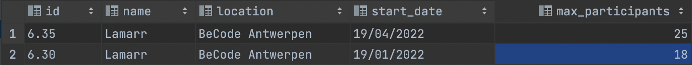
2.  
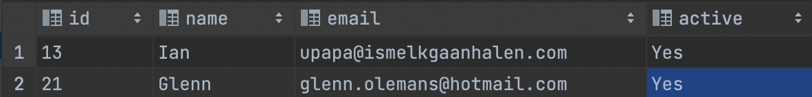
3.  
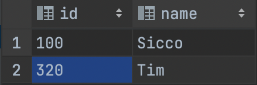

#### How did I create a table?

- Step 1  
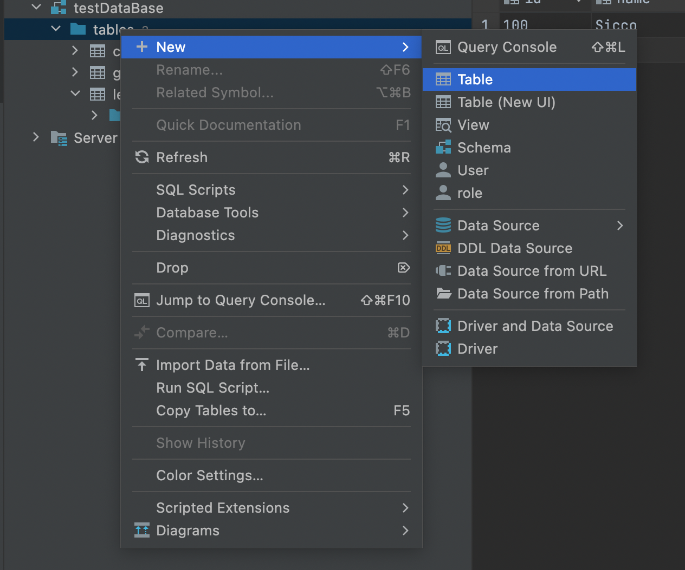  
  * You *right-click* on the tables and select *new* to make a new table
- Step 2  
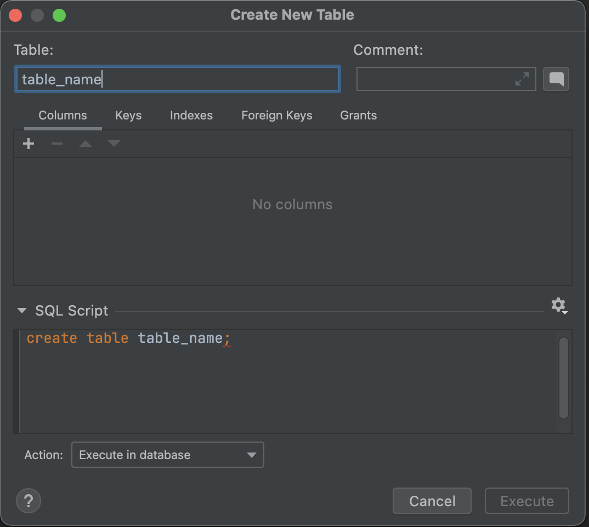  
  *  
- Step 3  
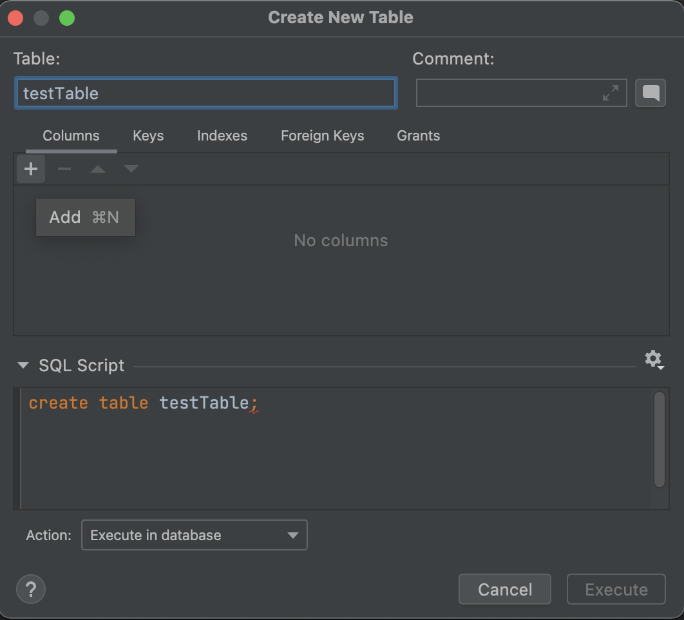  
  * 
- Step 4   
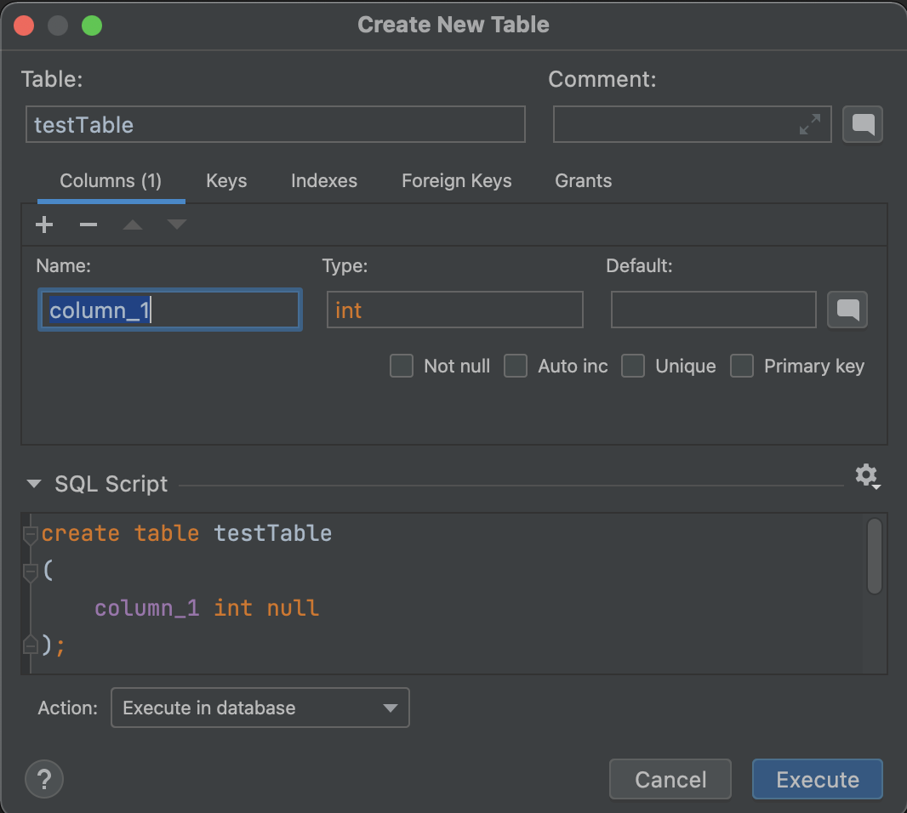  
  * 
- Step 5  
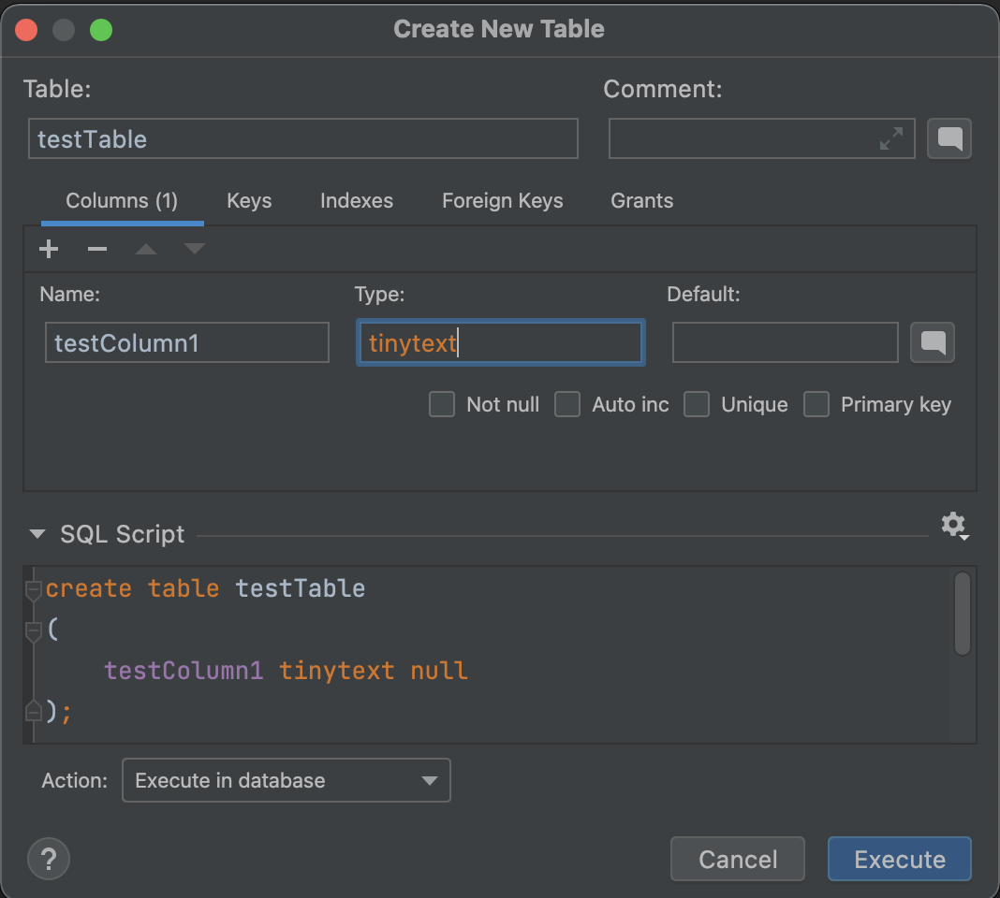  
  * 
- Step 6  
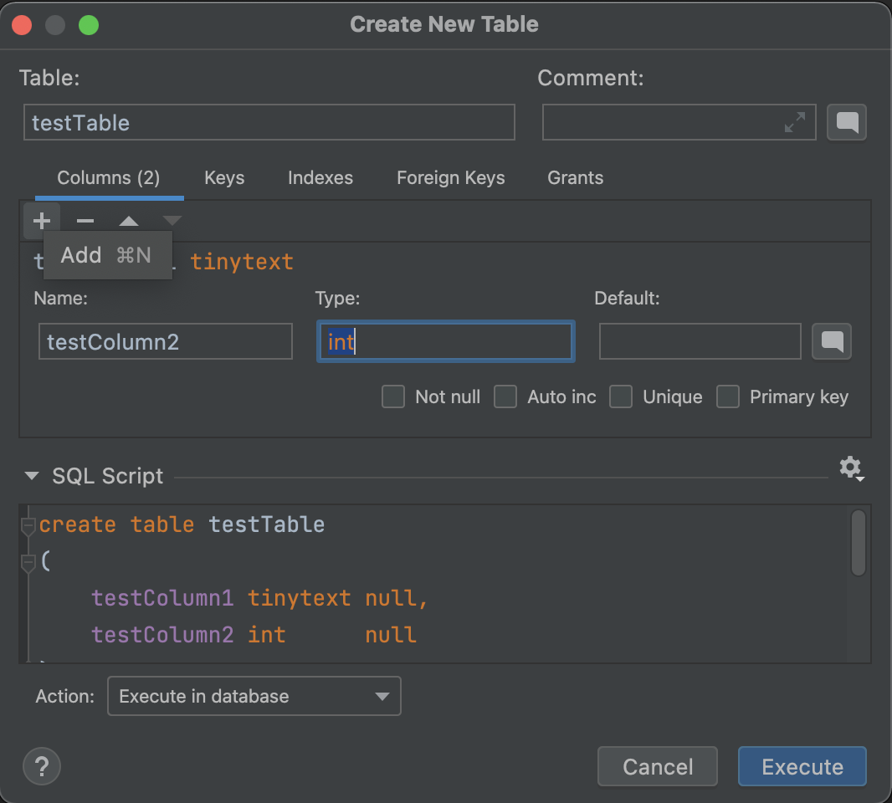  
  * 
- Step 7  
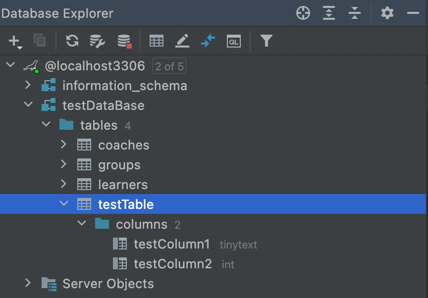  
  * Congratulations, we have made our table!
---
### Step 2

Try the following selects:
1. get all data from groups
2. Get the name and email of the first learner, and alias the name to learner_name

#### The console?

- Step 1 
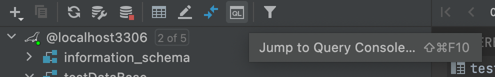  
  * The console is located on the top right
- Step 2 

  * The first one gets all the data from "groups"
  * The second one gets the name and email from the first learner and changes the "name" to "learner name"  
  

---
### Step 3

💩 happens - a group needs to be postponed
1. Update the start date of the first_group (make it two months later)
2. Introduce a new field status which can contain a long text indicating the reason for postponing

#### To be continued 

### useful links
* https://mariadb.com/kb/en/mariadb-basics/
* https://sqlzoo.net/wiki/SQL_Tutorial